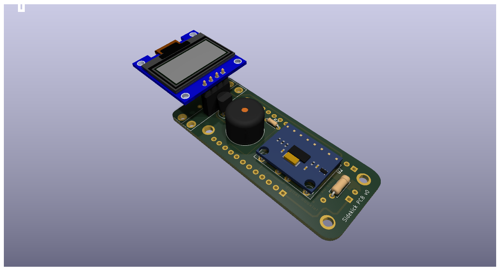
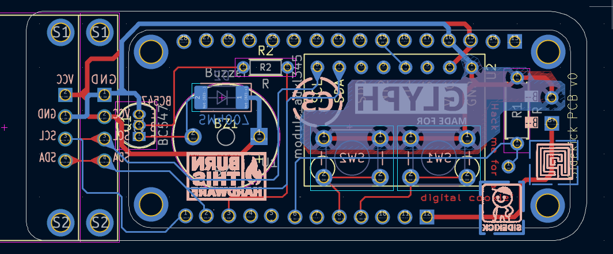

# pcb

> [!WARNING]
> This is a Work In Progress! PLease make an issue if you think something can be improved or if you find something wrong! Thanks.

This project follows the [Pride Versioning Scheme](https://pridever.org)! Current Version: `v0.5.0`

## Open Locally(KiCad)

> [!WARNING]
> Recursive is important as we use many submodules! If you forget to do this, ensure that you run the 3rd command from here where we run `git submodule update --init --recursive`

```bash
git clone https://github.com/MakerSidekick/pcb --recursive sidekick-pcb
```

```bash
cd sidekick-pcb
```

```bash
git submodule update --init --recursive
```

Now open KiCad, navigate to `File` -> `Open Project` and select this project. 

## Assets


### Render





### PCB


### Schematics 

[Click here for a link to schematics sheet, PDF](assets/sidekick-schematics.pdf)

### 3D View

[CLick here to open(step file)](assets/3d/sidekick.glb)


## License
<a href="https://github.com/MakerSidekick/pcb/">Sidekick (PCB Files)</a> © 2025 by <a href="https://sounddrill31.github.io">Souhrud Reddy</a> is licensed under <a href="https://creativecommons.org/licenses/by-sa/4.0/">CC BY-SA 4.0</a>

This license does not include/grant some files/folders under this repository. They will be mentioned in the next section. 
### License Exceptions and External Credits
The following folders are not included in the license mentioned above! These may be related or required to use the project.
#### Folder: PCBCUPID-SYS-FTP-STP
Used: Glyph C3 3D model, symbol and footprint. This is copyright of [pcbcupid](https://pcbcupid.com/), found publicly at: https://github.com/pcbcupid/PCBCUPID-SYS-FTP-STP

#### Folder: usini-sensors
Used: ADXL345 3d model, footprint, and symbol. This is copyright of [µsini](https://usini.eu/), found publicly at: https://github.com/usini/usini_kicad_sensors/blob/e2d03afffcb95ee2b2ff4183b6573658f2684229/usini_sensors.pretty/adxl345.step

Note:
- The 3d design is licensed under Creative Commons 0 by the same author, as per the README on the repository above, found publicly at: https://grabcad.com/library/adxl345-breakout-board-1

#### Folder: SnapEDA-Downloads
Used: DM-OLED096-636 3d model, footprint, and symbol. This is copyright of [SnapEDA](https://www.snapeda.com), found publicly at: https://www.snapeda.com/parts/DM-OLED096-636/Display%20Module/view-part/?ref=search&t=%20DM-OLED096-636%20&ab_test_case=b

Note: 
- According to the official FAQ, these seem to be licensed under Creative Commons Attribution-ShareAlike 4.0 International License (CC BY-SA) along with Design Exception 1.0. Link to the FAQ: https://www.snapeda.com/about/FAQ/

#### Folder: tg9541-modules
Used: None. TODO: Remove.

#### Folder: Glyph-C3
Used: none. TODO: Remove.
