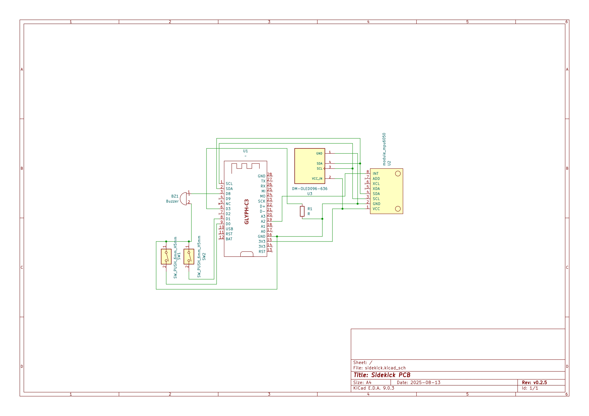
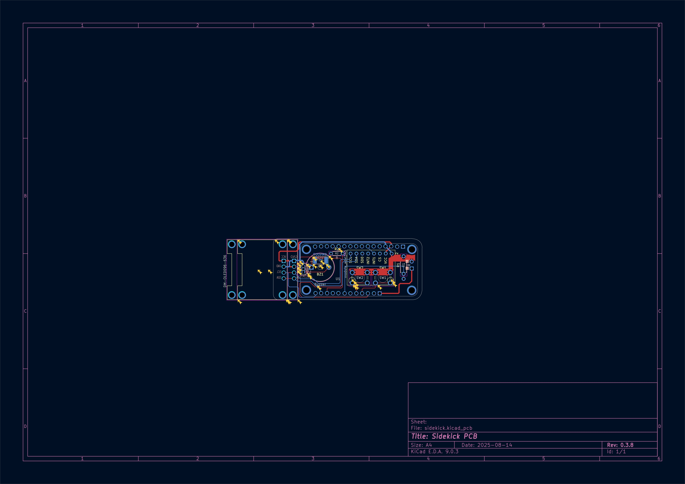
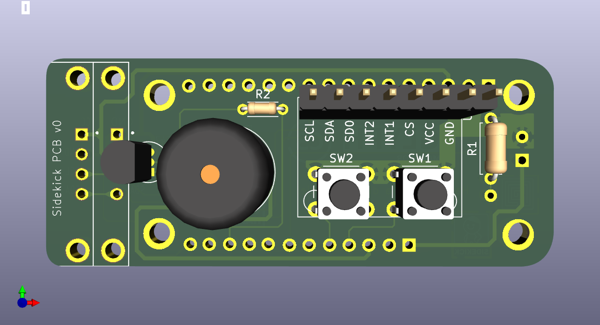
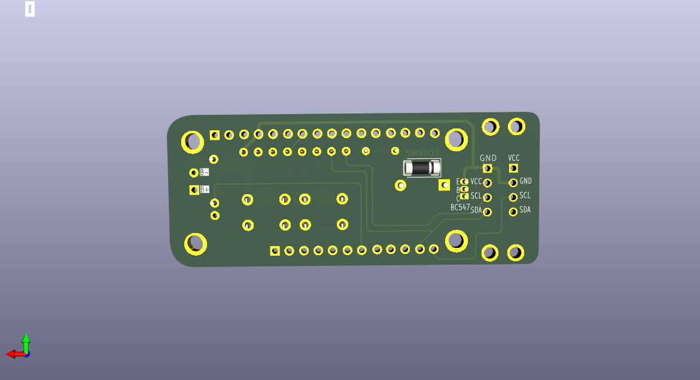

# pcb

> [!WARNING]
> This is a Work In Progress!

This project follows the [Pride Versioning Scheme](https://pridever.org)! Current Version: `v0.3.9`

## Open Locally(KiCad)

```bash
git clone https://github.com/MakerSidekick/pcb --recursive sidekick-pcb
```

```bash
cd sidekick-pcb
```

```bash
git submodule update --init --recursive
```

Now open KiCad, navigate to `File` -> `Open Project` and select this project. 

## Screenshots

### Schematics


### PCB


### Render




