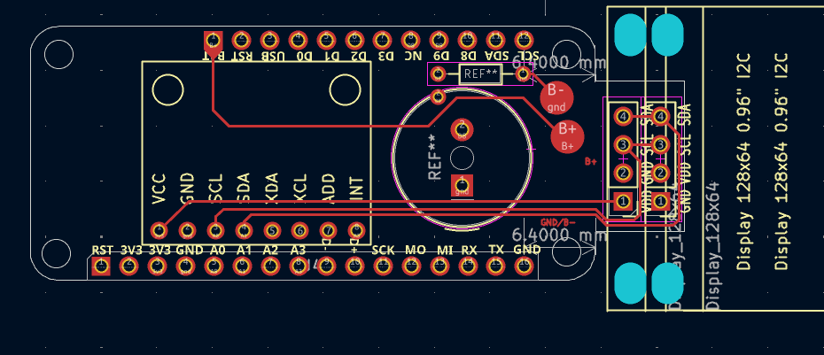
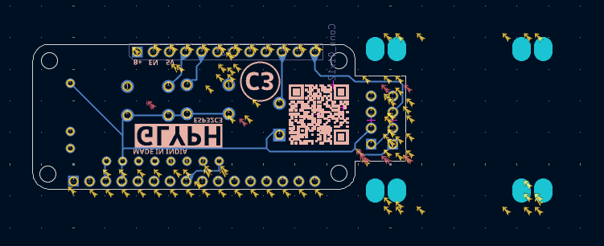

# pcb

```bash
git clone https://github.com/MeetSidekick/pcb --recursive sidekick-pcb
```

```bash
cd sidekick-pcb
```

```bash
git submodule update --init --recursive
```

> [!NOTE]
> This is the latest repo, please use this. Releases prior to v0.5.1 can be found there: https://github.com/MakerSidekick/pcb/releases/tag/v0.5.1

## Screenshots
### Front Layers

### Back Layers

